# Metaheuristics Framework
--------------------------------
### Notebook 1 - Simple Metaheuristics

## Imports


```python
# Python libraries
import numpy as np
import pandas as pd
import matplotlib.pyplot as plt

# Metaheuristics Framework Library
from metaheuristics.models import SimulatedAnnealing, TabuSearch, GeneticAlgorithm, VariableNeighborhoodDescent, GreedySearch

# Problem modeled with the Metaheuristics Framework
from loading_models import load_solomon, load_data
from vrptw import VRPTW, FlexVRPTW
from flowshop import FlowShop, load_flowshop
```

## Problem Instanciation
Choose a problem to work on

#### VRPTW


```python
vrptw_data = load_solomon('A50.csv', nb_cust=None, vehicle_speed=100)
problem = VRPTW(vrptw_data)
```

#### FlexibleVRPTW


```python
vrptw_data = load_solomon('A50.csv', nb_cust=None, vehicle_speed=100)
problem = FlexVRPTW(vrptw_data)
```

#### Machine Flow Shop Scheduling Problem


```python
flowshop_data = load_flowshop('FS10x100.csv')
problem = FlowShop(flowshop_data)
```


```python
problem.print_class_params()
```

# Metaheuristics

### Initial solution for every metaheuristic


```python
N = problem.neighborhood()
init_sol = N.initial_solution()
print('cost of initial solution =', init_sol.cost())
init_sol.plot_graph(figsize=8)
```

    cost of initial solution = 18942.063470476958
    


    
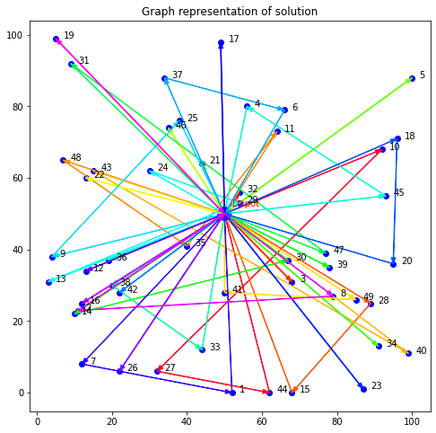
    


```python
if isinstance(problem, VRPTW) or isinstance(problem, FlexVRPTW):
    neighborhood_params={'verbose': 0,
                         'init_sol': init_sol,
                         'choose_mode': 'random',
                         'use_methods': [1, 2, 3, 4, 5, 6, 7, 8],
                         'force_new_sol': True,
                         'full_search': False}
    print('Using VRPTW neighborhood params')
    
elif isinstance(problem, FlowShop):
    neighborhood_params={'verbose': 0,
                         'init_sol': init_sol,
                         'choose_mode': 'random',
                         'use_methods': [1, 2],
                         'force_new_sol': True}
    print('Using Machine Flow Shop Scheduling Problem neighborhood params')
```

    Using VRPTW neighborhood params
    

## Simulated Annealing


```python
rs = SimulatedAnnealing(t0=30, progress_bar=True, neighborhood_params=neighborhood_params)
rs_sol = rs.fit_search(problem)
rs_sol
```

    Cost: 5891.78:   0%|          | 0/100 [00:00<?, ?it/s]           
    


    [[0, 3, 20, 5, 18, 45, 0],
     [0, 4, 6, 10, 39, 49, 47, 30, 0],
     [0, 34, 40, 23, 28, 8, 29, 0],
     [0, 24, 37, 25, 46, 0],
     [0, 43, 48, 22, 26, 33, 0],
     [0, 27, 2, 13, 36, 38, 0],
     [0, 41, 44, 15, 1, 7, 0],
     [0, 32, 21, 11, 17, 31, 19, 0],
     [0, 9, 14, 16, 12, 42, 35, 0]]


```python
rs_sol.plot_graph(figsize=8)
```


    
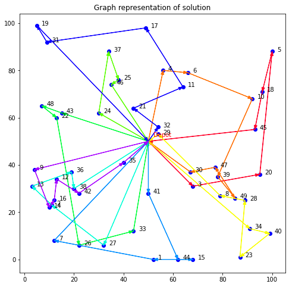
    


```python
rs.plot_evolution_cost(figsize=(15,7))
```


    
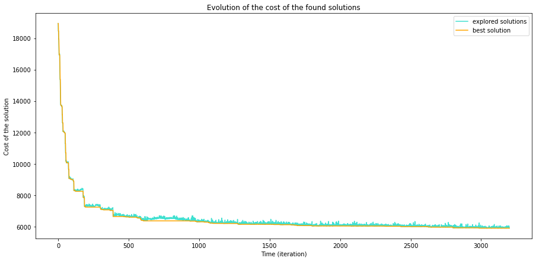
    


## Tabu Search


```python
ts = TabuSearch(progress_bar=True, neighborhood_params=neighborhood_params)
tabu_sol = ts.fit_search(problem)
tabu_sol
```

    Cost: 6963.39: 100%|██████████| 100/100 [00:00<00:00, 617.19it/s]
    


    [[0, 22, 48, 37, 24, 5, 0],
     [0, 36, 19, 17, 46, 38, 0],
     [0, 6, 41, 21, 16, 33, 30, 0],
     [0, 9, 49, 14, 42, 43, 35, 0],
     [0, 32, 4, 12, 45, 8, 47, 0],
     [0, 40, 15, 13, 26, 0],
     [0, 10, 1, 27, 44, 23, 28, 0],
     [0, 3, 39, 20, 18, 31, 2, 0],
     [0, 25, 34, 29, 7, 11, 0]]


```python
tabu_sol.plot_graph(figsize=8)
```


    
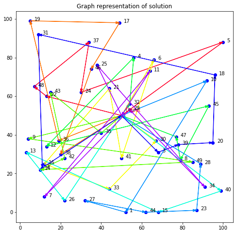
    


```python
ts.plot_evolution_cost(figsize=(15,7))
```


    
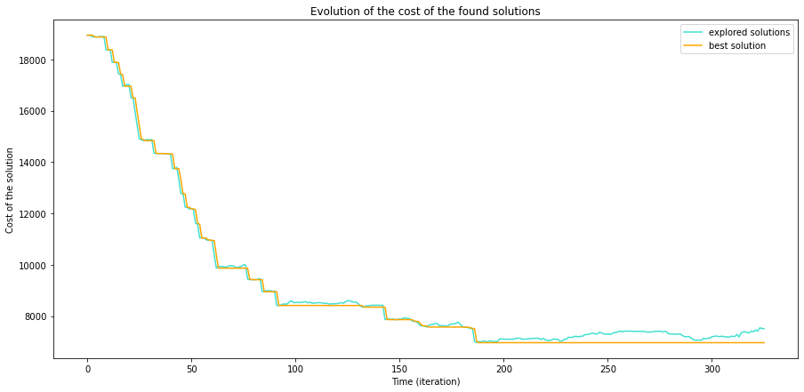
    


## Variable Neighborhood Descent


```python
vns = VariableNeighborhoodDescent(neighborhood_params=neighborhood_params)
vns_sol = vns.fit_search(problem)
print('cost of VNS solution found =', vns_sol.cost())
```

    cost of VNS solution found = 7796.632836342022
    


```python
vns_sol.plot_graph(figsize=8)
```


    
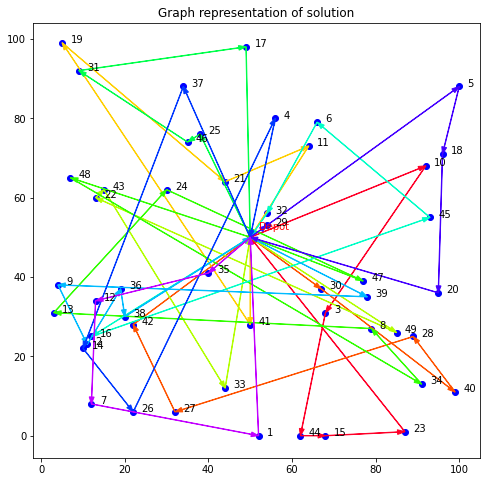
    


```python
vns.plot_evolution_cost(figsize=(15,7))
```


    
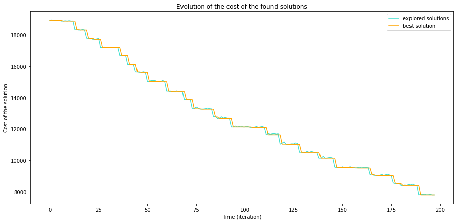
    


## GreedySearch


```python
gs = GreedySearch(progress_bar=True, neighborhood_params=neighborhood_params)
gs_sol = gs.fit_search(problem)
gs_sol
```

    Cost: 6182.32:   0%|          | 0/100 [00:00<?, ?it/s] 
    


    [[0, 9, 22, 2, 14, 13, 35, 0],
     [0, 20, 34, 49, 39, 47, 0],
     [0, 36, 38, 33, 15, 23, 0],
     [0, 26, 41, 32, 11, 17, 46, 0],
     [0, 6, 4, 25, 24, 21, 0],
     [0, 37, 43, 48, 12, 44, 28, 0],
     [0, 29, 18, 5, 19, 31, 0],
     [0, 30, 1, 27, 7, 16, 0],
     [0, 10, 45, 40, 8, 3, 42, 0]]


```python
gs_sol.plot_graph(figsize=8)
```


    
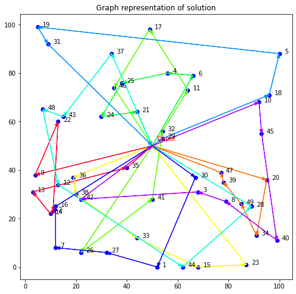
    


```python
gs.plot_evolution_cost(figsize=(15,7))
```


    
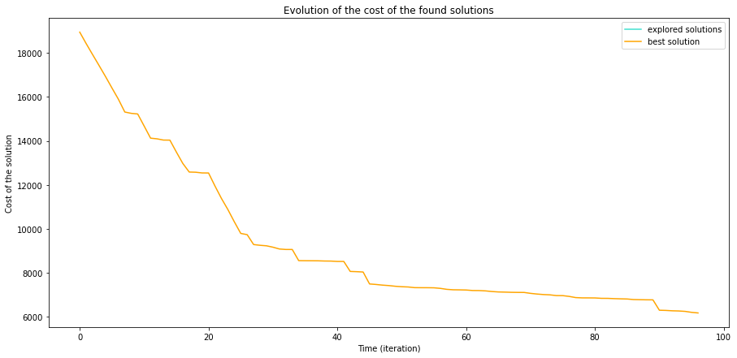
    


## Genetic Algorithm


```python
neighborhood_params={'verbose': 0,
                     'init_sol': 'random',
                     'choose_mode': 'random',
                     'use_methods': [1, 2, 3, 4, 5, 6, 7, 8],
                     'force_new_sol': True,
                     'full_search': False}
```


```python
ga = GeneticAlgorithm(num_evolu_per_search=500, rate_mutation=0.9, progress_bar=True, rate_crossover=0.3, neighborhood_params=neighborhood_params)
ga_sol = ga.fit_search(problem)
ga_sol
```

    Cost: 6291.77: 100%|██████████| 500/500 [00:37<00:00, 13.33it/s]
    


    [[0, 4, 5, 10, 18, 11, 17, 0],
     [0, 3, 8, 36, 26, 27, 12, 0],
     [0, 39, 45, 28, 30, 0],
     [0, 34, 40, 15, 23, 20, 47, 0],
     [0, 44, 1, 42, 38, 0],
     [0, 9, 48, 37, 6, 46, 43, 19, 0],
     [0, 22, 16, 7, 14, 49, 0],
     [0, 31, 25, 24, 35, 32, 21, 41, 0],
     [0, 33, 2, 13, 29, 0]]


```python
ga_sol.plot_graph(figsize=8)
```


    
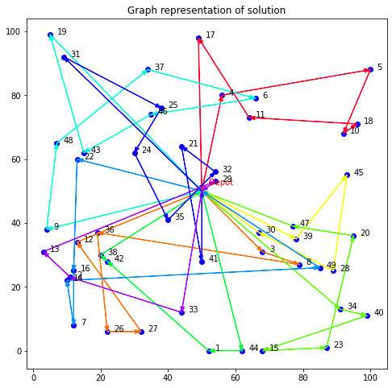
    


```python
ga.plot_evolution_cost(figsize=(15,7))
```


    
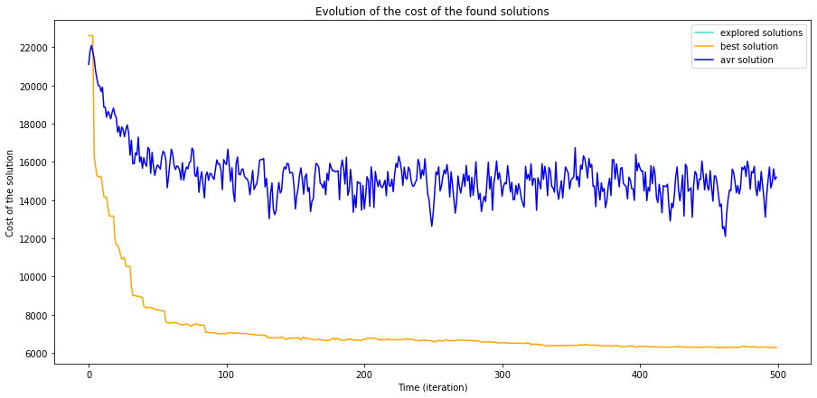
    


# Comparaisons


```python
def compare_solutions(init_sol, solutions, names):
    init_cost = init_sol.cost()
    costs = list(map(lambda s: s.cost(), solutions))
    plt.bar(names, costs, color='b', width=0.3, label='cost of solution found by metaheuristic')
    
    plt.plot([init_cost]*len(solutions), c='r', label='cost of initial solution')
    plt.title('Comparison of solutions found by different metaheuristics')
    plt.xticks(range(len(names)), names, rotation=45)
    plt.ylabel('Cost')
    plt.legend()
    
def plot_models_evolution(models, names, crop_until=None):
    for model, name in zip(models, names):
        plt.plot(model.evolution_best_solution, label=name)
    plt.xlabel('Number of iterations')
    plt.ylabel('Cost of solution')
    plt.title('Evolution of solution cost for different metaheuristics')
    plt.legend()
```


```python
solutions = [rs_sol, tabu_sol, ga_sol, vns_sol, gs_sol]
models = [rs, ts, ga, vns, gs]
names = ['Simulated Annealing', 'Tabu Search', 'Genetic Algorithm', 'VND', 'GreedySearch']
```


```python
compare_solutions(init_sol, solutions, names)
```


    
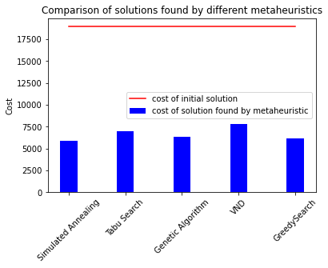
    


```python
plot_models_evolution(models, names)
```


    
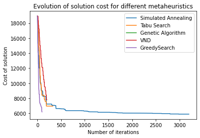
    

